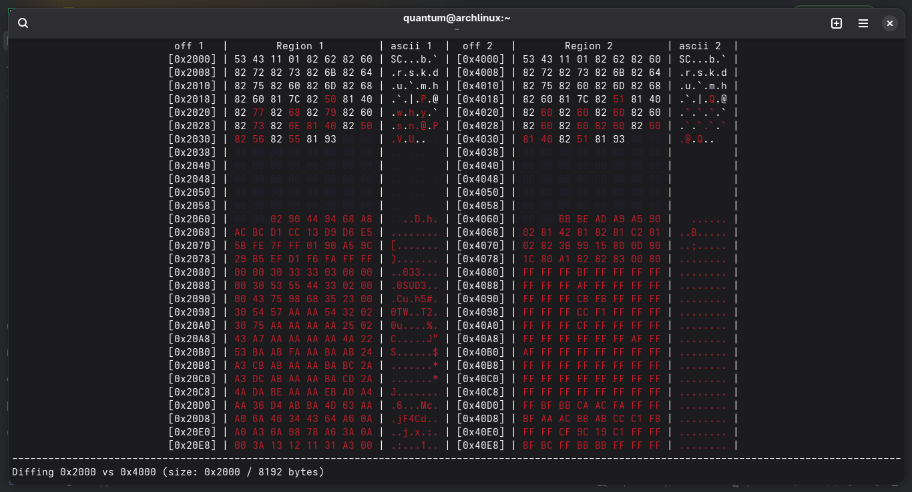
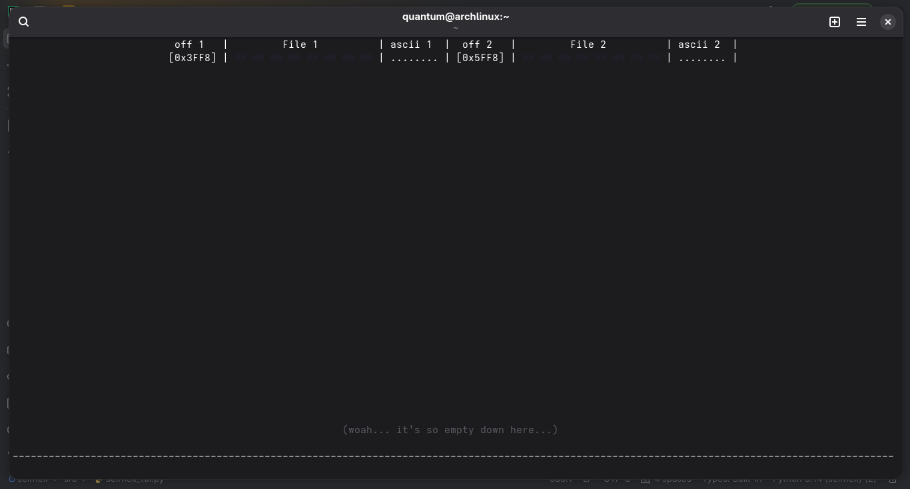

<div align="center">

# selfhex
**the only hex viewer starting at version 1.19.10+3**  
<sub>(as of 16/8/2026)</sub>

A _self-diffing_ capable hex viewer.  
Made with ♥ by quantum.


<br>
<sub>selfhex diffing 0x2000 with 0x4000 of the same file</sub>

</div>

> [!important]
> Currently, due to _heavy, unsupervised_ usage of `termios` and `tty`, selfhex only works on Linux! <sub>(and Android)</sub>  
> This limitation is expected to stay for the foreseeable future.  
> Sorry, not sorry, Windows people. </3

## Features
### Self-diffing capable
- Clone a file with the `:c[ln]` command; <sub>(selfhex will clean it automatically when it's unloaded, or you quit)</sub>
- Diff two files, or different regions of the same file with the `:d[iff]` command;

### Custom-built terminal interface
- Brand-new interface made from the ground up, with no external dependencies.
- _Vim-like-ish_ command system.

### Marks & findings
- Locate hex strings quickly with the `:f[n]` command;
- Keep track of your findings with the `:m[rk]` command;

## Requirements
To run selfhex, you'll need:
- Python v3.9+, for everything;
- That's it;

## Installation
You don't _really_ need to install **selfhex**, you can just clone the repository and run it directly:
```bash
git clone https://github.com/QuantumsSources/selfhex.git
cd selfhex
python3 src/selfhex.py
```

Optionally (but recommended), you can install it:
You'll need one thing:
- `pyinstaller`, to compile it; <sub>(If `pip` doesn't work, see the note below)</sub>
- This list has two bullet points, but you only had to read the first;

> [!note]
> On some Linux distributions (Arch, mainly, btw), `pip` cannot directly install `pyinstaller` due to PEP 668.
> 
> To install it, you can either:
> 1. Force `pip` to do it against its will: `pip install pyinstaller --break-system-packages`;
> 2. Use `pipx` (on Arch, `sudo pacman -S python-pipx`) to install `pyinstaller`. See below.

> [!important]
>  If you're using `pipx`, run this:
> ```bash
> # only if you're using pipx:
> pipx install pyinstaller
> pipx ensurepath
> ```
Then, clone the repository (if you haven't already), and run `build.py`, like this:
```bash
git clone https://github.com/QuantumsSources/selfhex.git
cd selfhex
python3 build.py
```
This will compile selfhex, link the binary to `~/.local/bin/selfhex`, and add a desktop entry.
Afterward, you can either reboot, or update the desktop database (and icon cache).

## Usage
### Command line
- Launch selfhex with your files loaded straight away with `selfhex <file> [<file>]`;
- You can also clone files from the command line with `selfhex <file> --clone`;
- And even create new files with `selfhex --new=<name> --size=<size>`;

### Interactive interface
- For only **$0.00**, everything above, _plus_...
- Load your files with the `:l[d]` command, or clone with `:c[ln]`;
- Need help? Run `:h[elp]` with either a page, or a command;

## Notes
- The icon for selfhex is ~~stolen~~ _borrowed_ from Sonic the Hedgehog 3.<br/>Original sprite by SEGA and Sonic Team, with minimal edits by me.

